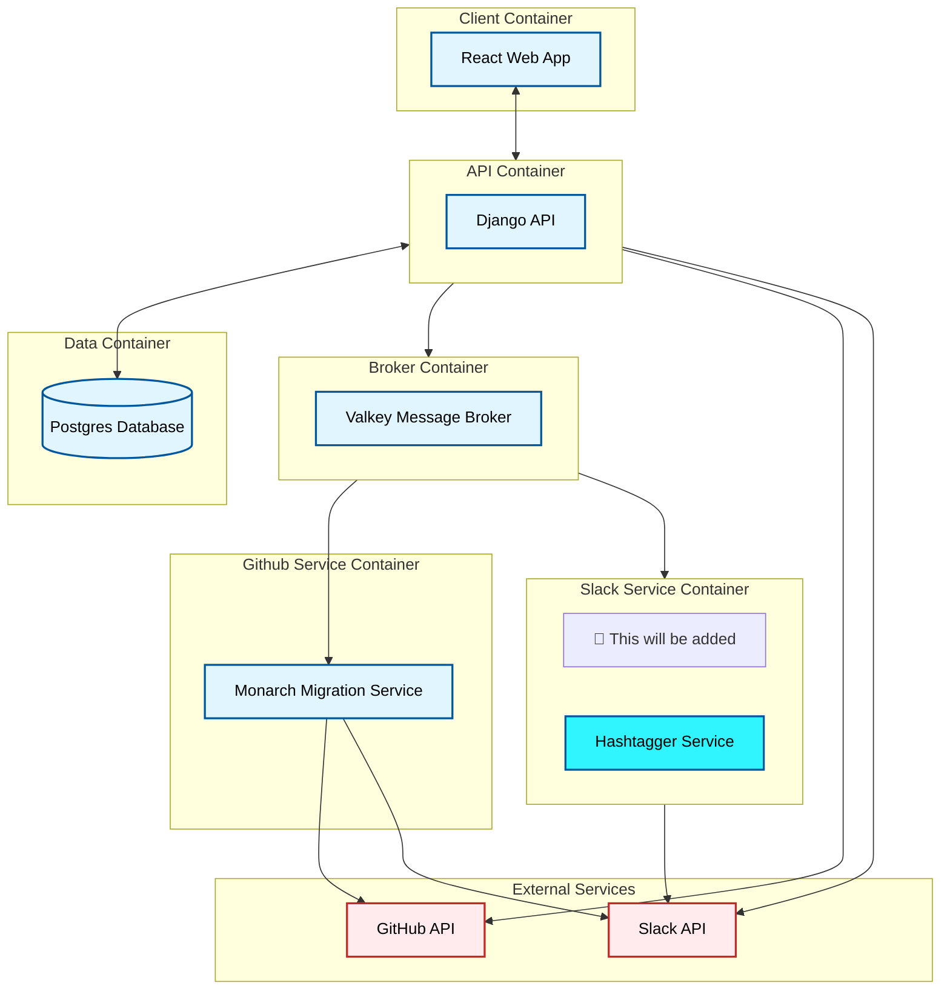

# Learning Platform - Docker Development Setup

## About

The Learning Platform is a comprehensive education management system built for Nashville Software School. It consists of a Django REST API backend and a React frontend, allowing instructors to track student progress, create courses, manage cohorts, and facilitate collaborative learning through integrated GitHub and Slack functionality.

## Learning Platform System Diagram




## Prerequisites

Before following these instructions, make sure you have followed the initial instructions in the [Learning Platform API](https://github.com/NSS-Workshops/learn-ops-api) repository and stopped at the **PAUSE: Set Up Infrastructure** section

## Getting Started

1. Clone this repository
2. `cd learn-ops-infrastructure`
3. `docker compose up -d`

When you start the Docker process in the infrastructure directory, the following actions happen:

- Start a PostgreSQL database
- Build and run the Django API _(with automatic database setup and seeding)_
- Build and run the React client
- Set up networking between all services

## Continue Platform Setup

Now that all of the containers are running for the API, the client, and the database, you can go back to the README for the API repository and continue with **Setup Continued...** section

## Development Workflow

### Making Code Changes

The containers use volume mounts, so any changes you make to the client application or the API application will be available within a few seconds after the development servers restart.

You may be used to changes in your code being available nearly instantaneously, but since you are now running everything in a container, the dev server restart process is a little slower.

### Viewing Logs
```bash
# All services
docker compose logs -f

# Specific services  
docker compose logs -f api database
docker compose logs -f client
```

### Rebuilding After Changes

If you make any changes to the configuration of the container:

1. Change values in the `.env` file
2. Change anything in the `docker-compose.yml` file of this repository
3. Change anything in the `Dockerfile` or `entrypoint.sh` file in the API directory
4. Change anything in the `Dockerfile` file in the client directory

Then you would need to run one of the following sets of commands.

If you changed the API container configuration:

```sh
docker compose down
docker compose build api
docker compose up
```

If you changed the client container configuration:

```sh
docker compose down
docker compose build client
docker compose up
```

If you want to truly rebuild everything from scratch, you can run:

```bash
docker compose down
docker compose up --build --force-recreate
```

### Running the API with VS Code Debugger

To debug the api with the VS Code debugger, the api container will need to be started with VS Code. 

1. Close the api VS Code instance if it is already opened. 
2. Stop all services
   ```sh
   docker compose down
   ```
3. Start ONLY the database and the client services
   ```sh
   docker compose up -d database client
   ```
4. Open the API with VS Code. You should see a prompt in the bottom right-hand corner that says, "Folder contains a Dev Container configuration file. Reopen folder to develop in a container." Click `Reopen in Container`.
5. Once the container has finished building, in the VS Code integrated terminal you should see:
   ```sh
   ⠹ Creating virtual environment...✔ Successfully created virtual environment!
   Virtualenv location: /root/.local/share/virtualenvs/app-4PlAip0Q
   To activate this project's virtualenv, run pipenv shell.
   Alternatively, run a command inside the virtualenv with pipenv run.
   Installing dependencies from Pipfile.lock (9e6e4d)...
   Installing dependencies from Pipfile.lock (9e6e4d)...
   Done. Press any key to close the terminal.
   ```
6. Now you can place breakpoints in the code and start the development server with the vs code debugger.

## Troubleshooting

### Port Conflicts
If you get port binding errors, make sure ports 3000, 8000, and 5432 are not in use by other applications.
