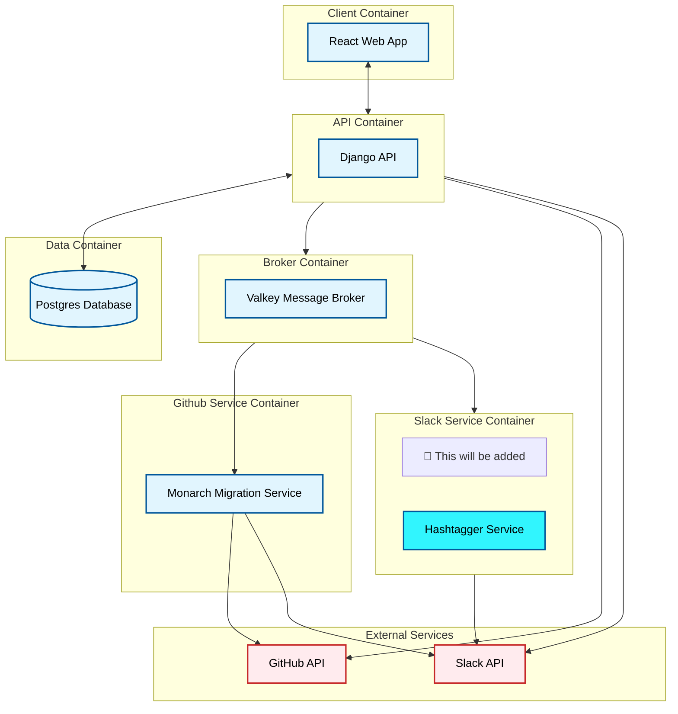

# Learning Platform - Docker Development Setup

## About

The Learning Platform is a comprehensive education management system built for Nashville Software School. It consists of a Django REST API backend and a React frontend, allowing instructors to track student progress, create courses, manage cohorts, and facilitate collaborative learning through integrated GitHub and Slack functionality.

## Learning Platform System Diagram

```mermaid
graph TD
    classDef container fill:#e1f5fe,stroke:#01579b,stroke-width:2px,color:#000
    classDef newcontainer fill:#31f5fe,stroke:#01579b,stroke-width:2px,color:#000
    classDef component fill:#fff3e0,stroke:#ff6f00,stroke-width:2px,color:#000
    classDef code fill:#f1f8e9,stroke:#33691e,stroke-width:2px,color:#000
    classDef external fill:#ffebee,stroke:#c62828,stroke-width:2px,color:#000

    subgraph Client["Client Container"]
        UI[React Web App]:::container
    end

    subgraph API["API Container"]
        LearningPlatform[Django API]:::container
    end


    subgraph Data["Data Container"]
        DB[(Postgres Database)]:::container
    end

    subgraph Broker["Broker Container"]
        Valkey[Valkey Message Broker]:::container
        
    end

    subgraph Migrator["Github Service Container"]
        Monarch[Monarch Migration Service]:::container
    end

    subgraph Hashtagger["Slack Service Container"]
        DataNote["📝 This will be added"]:::note
        HashtaggerService[Hashtagger Service]:::newcontainer
    end


    subgraph External["External Services"]
        Github[GitHub API]:::external
        Slack[Slack API]:::external
    end

    UI <--> API
    API <--> DB
    Monarch --> Github
    Monarch --> Slack
    Broker --> Monarch
    Broker --> Hashtagger
    API --> Broker
    API --> Github
    API --> Slack
    Hashtagger --> Slack
```

## Getting Started

1. Clone this repository into `~/workspace/lms/`
2. `cd learn-ops-infrastructure`
3. `make setup`

The setup wizard will handle everything else — checking prerequisites, cloning the other repos, collecting credentials, and starting the stack. See [SETUP_README.md](./SETUP_README.md) for a full breakdown of what the wizard does.

